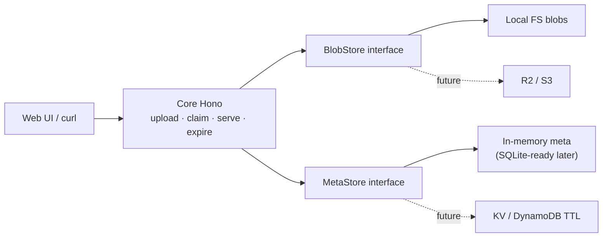

# stage-drop

Portable **instant static-site staging**: drag-and-drop a zip → get a temporary live URL → claim it before it expires.

Inspired by [Cloudflare Drop](https://www.cloudflare.com/drop/) ([llms.txt](https://www.cloudflare.com/drop/llms.txt)). This is an independent open-source clone focused on a **portable core** + local adapters. Cloud adapters (Workers/R2/KV, Lambda/S3/DynamoDB) are intentionally out of scope for v0.1.

## Quickstart (≤5 minutes)

```bash
git clone https://github.com/vovanduc/stage-drop.git
cd stage-drop
npm install
npm test          # should be green
npm run dev       # http://localhost:8787
```

1. Open the UI, drop a zip of a static site (must include `index.html`).
2. Open the **live URL** — site is served under `/s/:siteId/`.
3. Open the **claim URL** within 60 minutes to clear expiry (token is one-shot; only a hash is stored).

```bash
# Or upload via curl
zip -r site.zip index.html style.css
curl -sS -X POST http://localhost:8787/api/upload \
  -H 'content-type: application/zip' \
  --data-binary @site.zip | jq
```

## Product behavior

| Action | Behavior |
|--------|----------|
| Upload | Zip (≤10 MB, ≤500 files) → `{ liveUrl, claimUrl }` |
| Serve | `GET /s/:siteId/*` — **410** if expired & unclaimed |
| Claim | One-shot token (≥128-bit); store **hash only**; claim clears expiry |
| Sweep | Periodic cleanup of expired unclaimed sites |

## Architecture



- **Core**: TypeScript + [Hono](https://hono.dev) — portable HTTP surface.
- **BlobStore**: local filesystem today; swap-in for object storage later.
- **MetaStore**: in-memory map today; same interface for SQLite / KV / DynamoDB.

## Security (local demo)

- Zip max **10 MB**, max **500** files
- **Zip-slip** blocked (`..`, absolute paths)
- Content-type **allowlist** by extension
- In-memory **IP rate limit** on upload
- Claim tokens: `crypto.randomBytes(16)` → hex; SHA-256 hash only in meta

Not a production CDN: no malware scan, phishing heuristics, or CAPTCHA.

## Scripts

| Script | Purpose |
|--------|---------|
| `npm run dev` | Local server with reload (`tsx watch`) |
| `npm test` | Vitest suite |
| `npm run build` | Compile to `dist/` |
| `npm start` | Run compiled server |


## Docs site

Static companion landing (GitHub Pages, no upload API):

**https://vovanduc.github.io/stage-drop/**

> The live upload/claim server does **not** run on Pages. Use `npm run dev` locally (or later Workers). The URL above is live after Pages is enabled for `/docs` on `master`.

Skin: **Custom polish** (hand-rolled `docs/index.html` + `styles.css`; reviewed 2026-09-23, keep current).

## License

[MIT](./LICENSE) © Duc Vo
