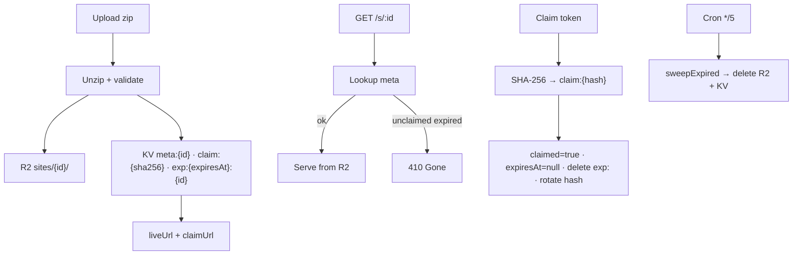
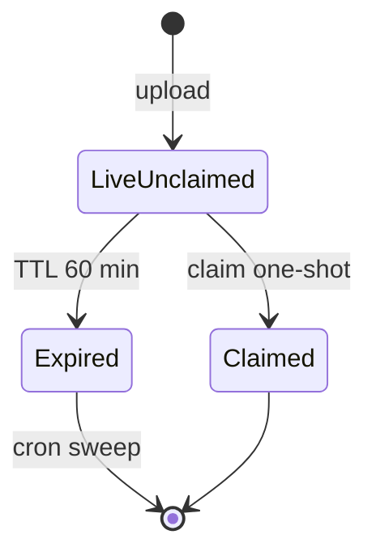

# stage-drop

Portable **instant static-site staging**: drag-and-drop a zip → get a temporary live URL → claim it before it expires.

Inspired by [Cloudflare Drop](https://www.cloudflare.com/drop/) ([llms.txt](https://www.cloudflare.com/drop/llms.txt)). Independent open-source clone: **portable Hono core** + swappable adapters (local FS/memory today; **Cloudflare R2 + KV** for the lab Worker).

## Lab URL (Cloudflare Workers)

| | |
|--|--|
| **App** | https://lab.vovanduc.tech/stage-drop/ |
| **Health** | https://lab.vovanduc.tech/stage-drop/health |
| **Worker** | name `lab` (Custom Domain `lab.vovanduc.tech`) |
| **Docs site** | https://vovanduc.github.io/stage-drop/ → redirects to this repo (GitHub Pages `/docs`) |

Pages vs lab: **Pages** = minimal redirect from `docs/` to this GitHub repo. **Lab Worker** = real upload/claim/serve under `/stage-drop`. Architecture diagrams live in this README (mermaid).

Ops checklist (R2/KV/secrets/deploy): see **[LAB.md](./LAB.md)**.

## Quickstart — local Node (≤5 minutes)

```bash
git clone https://github.com/vovanduc/stage-drop.git
cd stage-drop
npm install
npm test          # should be green
npm run dev       # http://localhost:8787
```

1. Open the UI, drop a zip of a static site (must include `index.html`).
2. Open the **live URL** — site is served under `/s/:siteId/`.
3. Open the **claim URL** within 60 minutes to clear expiry (token is one-shot; only a hash is stored).

```bash
# Or upload via curl
zip -r site.zip index.html style.css
curl -sS -X POST http://localhost:8787/api/upload \
  -H 'content-type: application/zip' \
  --data-binary @site.zip | jq
```

## Quickstart — Cloudflare Workers (lab)

```bash
npm install
# Create R2 + KV, paste KV id into wrangler.jsonc (see LAB.md)
npx wrangler r2 bucket create stage-drop-blobs
npx wrangler kv namespace create META
npm run deploy    # wrangler deploy → Worker "lab"
# or locally: npm run dev:worker
```

Requires Wrangler auth and a filled `kv_namespaces[0].id`. CI: set GitHub secrets `CLOUDFLARE_API_TOKEN` + `CLOUDFLARE_ACCOUNT_ID` (workflow `.github/workflows/deploy-lab.yml`).

## Product behavior

| Action | Behavior |
|--------|----------|
| Upload | Zip (≤10 MB, ≤500 files) → `{ liveUrl, claimUrl }` |
| Serve | `GET /s/:siteId/*` — **410** if expired & unclaimed |
| Claim | One-shot token (≥128-bit); store **hash only**; claim clears expiry |
| Sweep | Periodic cleanup of expired unclaimed sites (local interval / Worker cron `*/5 * * * *`) |

## Architecture


```mermaid
flowchart TD
  U["Upload zip"] --> V["Unzip + validate"]
  V --> R2["R2 sites/{id}/"]
  V --> KV["KV meta:{id} · claim:{sha256} · exp:{expiresAt}:{id}"]
  KV --> URL["liveUrl + claimUrl"]
  S["GET /s/:id"] --> M["Lookup meta"]
  M -->|ok| SR["Serve from R2"]
  M -->|unclaimed expired| G["410 Gone"]
  C["Claim token"] --> H["SHA-256 → claim:{hash}"]
  H --> CL["claimed=true · expiresAt=null · delete exp: · rotate hash"]
  CR["Cron */5"] --> SW["sweepExpired → delete R2 + KV"]
```


```mermaid
stateDiagram-v2
  [*] --> LiveUnclaimed: upload
  LiveUnclaimed --> Claimed: claim one-shot
  LiveUnclaimed --> Expired: TTL 60 min
  Expired --> [*]: cron sweep
  Claimed --> [*]
```

- **Core**: TypeScript + [Hono](https://hono.dev) — portable HTTP surface (`createApp`).
- **Zip**: [fflate](https://github.com/101arrowz/fflate) (Uint8Array) — same path on Node and Workers.
- **Local**: `FsBlobStore` + `MemoryMetaStore` via `src/server.ts`.
- **Workers (lab)**: `R2BlobStore` + `KvMetaStore` via `src/worker.ts`, base path `/stage-drop`.
- **Pages**: `docs/` → GitHub Pages redirect to this repo. **Lab**: real API at https://lab.vovanduc.tech/stage-drop/.

## Security (lab / local demo)

- Zip max **10 MB**, max **500** files
- **Zip-slip** blocked (`..`, absolute paths)
- Content-type **allowlist** by extension
- In-memory **IP rate limit** on upload (ephemeral per isolate on Workers — OK for demos)
- Claim tokens: 128-bit random → hex; SHA-256 hash only in meta

Not a production CDN: no malware scan, phishing heuristics, or CAPTCHA.

## Scripts

| Script | Purpose |
|--------|----------|
| `npm run dev` | Local Node server with reload (`tsx watch`) |
| `npm run dev:worker` | `wrangler dev` (local Workers runtime + R2/KV sim) |
| `npm run deploy` | `wrangler deploy` to Worker `lab` |
| `npm test` | Vitest suite |
| `npm run build` | Compile to `dist/` |
| `npm start` | Run compiled Node server |

## Docs site

GitHub Pages (`master` / `docs/`) redirects to this repository:

**https://vovanduc.github.io/stage-drop/** → **https://github.com/vovanduc/stage-drop**

Keeps `docs/.nojekyll`. Intro landing retired; architecture mermaid above is canonical for readers.

## Agent setup

For AI agents (Claude, OpenCode, Orca, Cursor, Windsurf, …) working on this repo — portable Cloudflare skills + MCP, not host-locked:

→ **[docs/agent-setup.md](./docs/agent-setup.md)** (official prompt: [developers.cloudflare.com/agent-setup/prompt.md](https://developers.cloudflare.com/agent-setup/prompt.md))

## License

[MIT](./LICENSE) © Duc Vo
